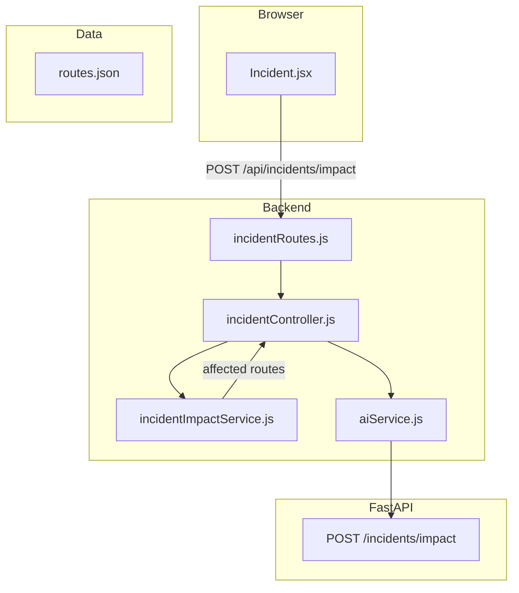

# AI-based impact estimation (simple guide)

**What users get:** After an incident is classified, they can ask for **estimated delay (minutes)**, **recovery time**, **which routes are affected**, and **suggested other routes** to consider.  
**Note:** Automatically updating every passenger ETA or sending phone alerts is **not** built as background jobs here — other services would listen to the same API or events later.

---

## Workflow

1. Backend finds **affected route names** from `routes.json` using the **location** string (same stop-name match as classification).
2. It picks a few **reroute** route names not in the affected set.
3. FastAPI runs **two regressors** (delay minutes and recovery minutes) from category, severity, count of affected routes, and hour — or a small numeric **fallback** if PKL missing.

---

## Every file that belongs to this feature

### Training data (CSV)

| File | Role |
|------|------|
| [`ai-services/data/impact_train.csv`](../ai-services/data/impact_train.csv) | category, severity, affected_route_count, hour, delay_minutes, recovery_minutes |

### Trained artifacts (PKL)

| Path | Role |
|------|------|
| `ai-services/models/impact_delay_model.pkl` | Predicts delay (minutes) |
| `ai-services/models/impact_recovery_model.pkl` | Predicts recovery (minutes) |
| `ai-services/encoders/impact_category_encoder.pkl` | Encodes category string for the model |
| `ai-services/encoders/impact_severity_encoder.pkl` | Encodes severity string |

### Training script (Python)

| File | Role |
|------|------|
| [`ai-services/training/train_incidents.py`](../ai-services/training/train_incidents.py) | Second half of script trains impact models from `impact_train.csv` |

### AI API (Python)

| File | Role |
|------|------|
| [`ai-services/app/api/incidents.py`](../ai-services/app/api/incidents.py) | `POST /incidents/impact` — builds feature row, predicts delay + `recovery_time` |

### Static routes (JSON)

| File | Role |
|------|------|
| [`ai-services/data/routes.json`](../ai-services/data/routes.json) | Affected + reroute lists |

### Backend (Node)

| File | Role |
|------|------|
| [`backend/controllers/incidentController.js`](../backend/controllers/incidentController.js) | `estimateImpact` — builds payload including optional `hour` |
| [`backend/routes/incidentRoutes.js`](../backend/routes/incidentRoutes.js) | `POST /impact` |
| [`backend/services/incidentImpactService.js`](../backend/services/incidentImpactService.js) | `findAffectedRouteNames`, `pickReroutes` |
| [`backend/services/aiService.js`](../backend/services/aiService.js) | `getImpact` |

### Frontend

| File | Role |
|------|------|
| [`frontend/src/pages/Incident.jsx`](../frontend/src/pages/Incident.jsx) | Button “Estimate impact” after classify |

---

## How to verify

1. Same PKL as incident training (`train_incidents.py`).
2. `POST /api/incidents/impact` with body: `location`, `category`, `severity`, optional `hour`.
3. UI: classify first, then estimate impact — numbers and route lists should appear.

---

## Limits

- No road-geometry “segments” — only route lists from stop names.
- Alerts / global ETA refresh = future integration.
