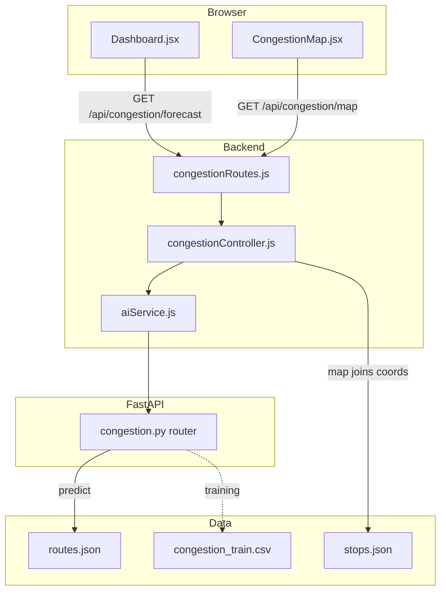

# Congestion monitoring and prediction (simple guide)

**What users get:** A **dashboard** with hourly congestion summaries, a **map** with colored road segments (green / yellow / red), and APIs that the **planner** uses for traffic level. The ML model is trained on **synthetic** segment data for demo; you can swap in real GPS data later.

---

## Workflow

1. **Segments** are built as `RouteName|StopA->StopB` from `routes.json`.
2. The **classifier** predicts LOW/MEDIUM/HIGH per segment for a given **hour** and **day of week**.
3. **Express** proxies `/current`, `/forecast`, `/predict` to FastAPI. **`/map`** adds **lat/lon** from `stops.json` for lines on the Leaflet map.
4. **`planner-traffic`** compresses many segments into one level for the commute planner.

---

## Every file that belongs to this feature

### Training data (CSV)

| File | Role |
|------|------|
| [`ai-services/data/congestion_train.csv`](../ai-services/data/congestion_train.csv) | Written by `train_congestion.py` — segment_key, hour, dow, level |

### Trained artifacts (PKL)

| Path | Role |
|------|------|
| `ai-services/models/congestion_model.pkl` | RandomForest: predicts LOW/MEDIUM/HIGH |
| `ai-services/encoders/congestion_segment_encoder.pkl` | Encodes segment string |

### Training script (Python)

| File | Role |
|------|------|
| [`ai-services/training/train_congestion.py`](../ai-services/training/train_congestion.py) | Builds segments from `routes.json`, generates synthetic CSV, trains PKL |

### AI API (Python)

| File | Role |
|------|------|
| [`ai-services/app/api/congestion.py`](../ai-services/app/api/congestion.py) | `/predict`, `/current`, `/forecast`, `/planner-traffic` |
| [`ai-services/app/main.py`](../ai-services/app/main.py) | `load_congestion_artifacts()`, mounts router under `/congestion` |

### Network + map data (JSON)

| File | Role |
|------|------|
| [`ai-services/data/routes.json`](../ai-services/data/routes.json) | Defines segments |
| [`ai-services/data/stops.json`](../ai-services/data/stops.json) | Stop name → lat/lon for polylines |

### Backend (Node)

| File | Role |
|------|------|
| [`backend/controllers/congestionController.js`](../backend/controllers/congestionController.js) | Proxies AI; `getMap` merges predictions with `stops.json` |
| [`backend/routes/congestionRoutes.js`](../backend/routes/congestionRoutes.js) | `/current`, `/forecast`, `/map`, `/predict` |
| [`backend/services/aiService.js`](../backend/services/aiService.js) | `getCongestionCurrent`, `getCongestionForecast`, `predictCongestion`, `getPlannerTrafficLevel` |
| [`backend/app.js`](../backend/app.js) | Mounts `/api/congestion` |

### Frontend

| File | Role |
|------|------|
| [`frontend/src/pages/CongestionMap.jsx`](../frontend/src/pages/CongestionMap.jsx) | Leaflet map + hour slider |
| [`frontend/src/pages/Dashboard.jsx`](../frontend/src/pages/Dashboard.jsx) | Forecast timeline cards |
| [`frontend/src/main.jsx`](../frontend/src/main.jsx) | Imports Leaflet CSS |

---

## How to verify

1. `python training/train_congestion.py` in `ai-services`.
2. FastAPI: `GET /congestion/current`.
3. Backend: `GET /api/congestion/map?hour=8`.
4. Browser: `/congestion` and `/dashboard`.

---

## Limits

- Training data is **simulated**, not real traffic.
- Map only draws segments where **both** stops exist in `stops.json`.
