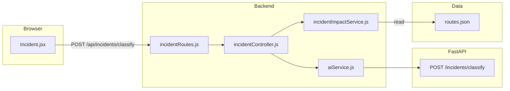

# Incident classification and routing (simple guide)

**What users get:** They type what happened and where. The system guesses **category** (e.g. accident, breakdown) and **severity** (LOW/MEDIUM/HIGH) using ML, then shows **which team** should handle it based on rules + which routes touch that location.

---

## Workflow

1. Browser sends **description** + **location** text.
2. FastAPI runs **TF-IDF + logistic regression** (if PKL files exist) or **keyword fallback**.
3. Backend loads `routes.json` and finds route names whose stop list **contains** that location string (exact name match).
4. `assignAuthority` picks a human-readable **team name** from category + severity + optional first affected route.

---

## Every file that belongs to this feature

### Training data (CSV)

| File | Role |
|------|------|
| [`ai-services/data/incident_train.csv`](../ai-services/data/incident_train.csv) | Columns: text, location, category, severity — used to train classifiers |

### Trained artifacts (PKL)

| Path | Role |
|------|------|
| `ai-services/encoders/incident_vectorizer.pkl` | TF-IDF: text → numbers |
| `ai-services/models/incident_category_clf.pkl` | Predicts category |
| `ai-services/models/incident_severity_clf.pkl` | Predicts severity |

### Training script (Python)

| File | Role |
|------|------|
| [`ai-services/training/train_incidents.py`](../ai-services/training/train_incidents.py) | Reads CSV, trains vectorizer + both classifiers, also trains **impact** models (same script) |

### AI API (Python)

| File | Role |
|------|------|
| [`ai-services/app/api/incidents.py`](../ai-services/app/api/incidents.py) | `POST /incidents/classify` — load PKL or use `_fallback_classify` |
| [`ai-services/app/main.py`](../ai-services/app/main.py) | Calls `load_incident_artifacts()` and mounts the incidents router |

### Static routes (JSON)

| File | Role |
|------|------|
| [`ai-services/data/routes.json`](../ai-services/data/routes.json) | Used by Node to find **affected route names** from location |

### Backend (Node)

| File | Role |
|------|------|
| [`backend/controllers/incidentController.js`](../backend/controllers/incidentController.js) | `classifyIncident` — calls AI, then `assignAuthority(...)` |
| [`backend/routes/incidentRoutes.js`](../backend/routes/incidentRoutes.js) | `POST /classify` |
| [`backend/services/incidentImpactService.js`](../backend/services/incidentImpactService.js) | `loadRoutesDataset`, `findAffectedRouteNames` |
| [`backend/services/aiService.js`](../backend/services/aiService.js) | `classifyIncident` |

### Frontend

| File | Role |
|------|------|
| [`frontend/src/pages/Incident.jsx`](../frontend/src/pages/Incident.jsx) | Form + results |

---

## How to verify

1. Run `python training/train_incidents.py` in `ai-services` (creates incident PKL files).
2. Start FastAPI + backend with `AI_SERVICE_URL`.
3. Use `/incident` or `POST /api/incidents/classify` with JSON `description` and `location` matching a real stop name from `routes.json` if you want affected routes to show up in team text.

---

## Limits

- Location is plain text; it only matches **stop names** in `routes.json`, not GPS.
- Team names are **strings** for demo routing, not a live ticketing system.
