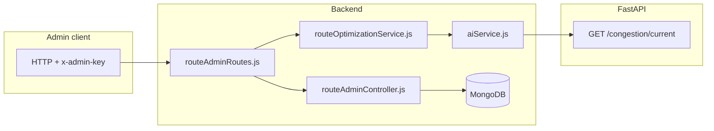

# Route configuration and optimization (simple guide)

**What this does:** Admins can **store routes in MongoDB** (name + list of stops + note). A separate API returns **text suggestions** (e.g. “add frequency”) using **live congestion** counts per route.  
**Important:** The **commute planner** still reads **`ai-services/data/routes.json`** today. Mongo routes are for **admin + suggestions** until you add a sync step.

---

## Workflow

1. **CRUD** only runs if header `x-admin-key` matches `ADMIN_KEY` or default `dev-secret-admin`.
2. **Suggestions** call FastAPI congestion **current**, count HIGH/MEDIUM per **route prefix** of each segment key, then build hint objects.
3. If Mongo has **no routes**, the service may suggest importing from the JSON file (message only).

---

## Every file that belongs to this feature

### Database model (Node / Mongoose)

| File | Role |
|------|------|
| [`backend/models/TransitRoute.js`](../backend/models/TransitRoute.js) | Schema: `name`, `stops[]`, `scheduleNote` |

### Middleware

| File | Role |
|------|------|
| [`backend/middleware/requireAdminKey.js`](../backend/middleware/requireAdminKey.js) | Checks `x-admin-key` vs `process.env.ADMIN_KEY` |

### Controllers + routes

| File | Role |
|------|------|
| [`backend/controllers/routeAdminController.js`](../backend/controllers/routeAdminController.js) | List/create/update/delete routes; `getSuggestions` |
| [`backend/routes/routeAdminRoutes.js`](../backend/routes/routeAdminRoutes.js) | `GET /optimization-suggestions` **before** `/:id` to avoid route conflicts |

### Optimization logic

| File | Role |
|------|------|
| [`backend/services/routeOptimizationService.js`](../backend/services/routeOptimizationService.js) | `buildOptimizationSuggestions` — uses `getCongestionCurrent` |

### AI client

| File | Role |
|------|------|
| [`backend/services/aiService.js`](../backend/services/aiService.js) | `getCongestionCurrent` |

### Reference data (planner still uses file)

| File | Role |
|------|------|
| [`ai-services/data/routes.json`](../ai-services/data/routes.json) | Mentioned in suggestion text when DB empty |

### Audit

| File | Role |
|------|------|
| [`backend/models/AuditLog.js`](../backend/models/AuditLog.js) | Route create/update/delete logged |

### App mount

| File | Role |
|------|------|
| [`backend/app.js`](../backend/app.js) | `app.use('/api/admin/routes', routeAdminRoutes)` |

---

## Env reminder

- Backend `.env`: `MONGO_URI` (**your** URI), `AI_SERVICE_URL` for suggestions.
- Admin header: `x-admin-key: dev-secret-admin` unless you set `ADMIN_KEY`.

---

## How to verify

1. Mongo running, backend `.env` set.
2. `POST /api/admin/routes` with header and JSON body `{ "name": "Test", "stops": ["A","B"] }`.
3. `GET /api/admin/routes/optimization-suggestions?hour=8` with same header.

---

## Limits

- Planner does not auto-read Mongo yet — needs a follow-up feature to sync or query DB.
